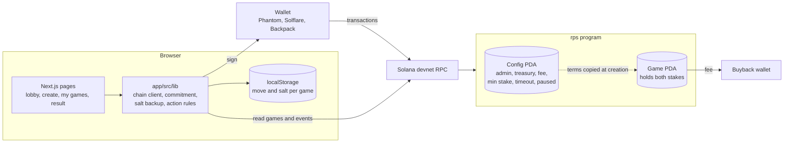
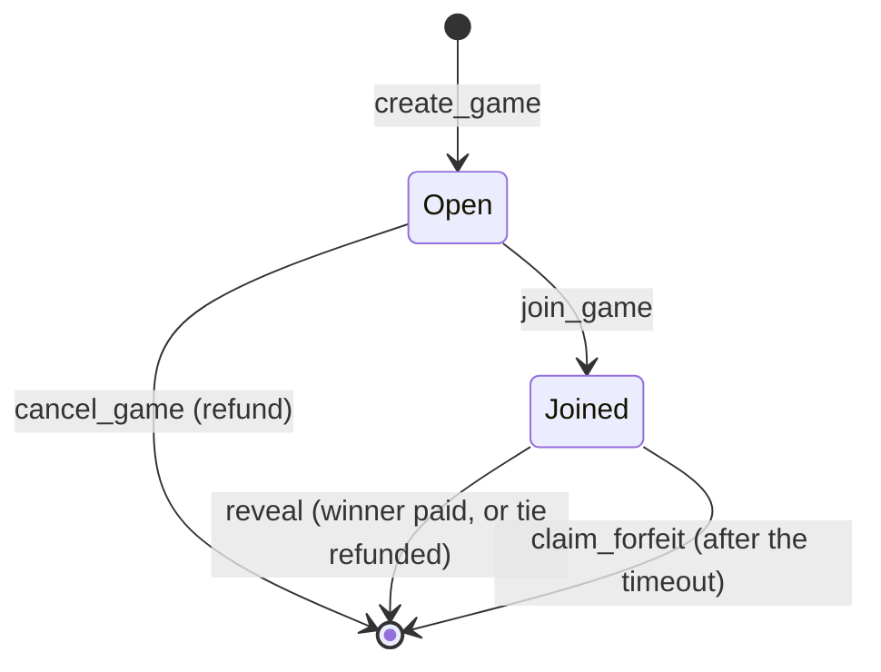

# Solana RPS

Commit-reveal Rock-Paper-Scissors on Solana where two players wager SOL. The
winner pays a small fee that goes to a buyback wallet.

**Devnet only.** The program is unaudited and must not be used with real funds.
See [SECURITY.md](SECURITY.md).

| | |
|---|---|
| Program ID (devnet) | `Fmi151zsEHFgRJeUXNgDjbo4aLA6PRQ63ktWM6sCEgkA` |
| Config account | `Ea7DkC7AGUVv1e9dfQKY6QEBHYsDT3rGcQhs1rXRARPf` |
| Buyback wallet (devnet) | `8Besg2ve5XhT7X9ckA3H96CnER9bBW7TwbincQ6QFTcu` |
| Fee | 2.5% of the pot, paid by the winner |
| Minimum stake | 0.01 SOL, no maximum |
| Reveal timeout | 10 minutes |

[View the program on Solana Explorer](https://explorer.solana.com/address/Fmi151zsEHFgRJeUXNgDjbo4aLA6PRQ63ktWM6sCEgkA?cluster=devnet)

## How to play

You need a Solana wallet (Phantom, Solflare or Backpack) set to devnet, and some
devnet SOL from the [faucet](https://faucet.solana.com).

1. **Create a game.** Pick a stake and a hand. The app seals your move: it
   sends only `sha256(move || salt || your_wallet)`, so nobody can see what you
   played. Download the backup file when asked. It holds your move and the
   random salt, and you cannot reveal without it.
2. **Someone joins.** An opponent matches your stake and plays their hand in the
   open. That is safe because your move is already locked in.
3. **Reveal.** The app prompts you as soon as your game is joined. Revealing
   sends your move and salt, the program checks them against the seal, and pays
   out. The winner takes both stakes minus the fee. A tie refunds both players.

Two things can end a game early:

- **Cancel.** The creator can cancel any time before someone joins and get the
  stake back.
- **Forfeit.** If the creator does not reveal within 10 minutes of a join, the
  opponent can claim the pot, minus the same fee. So if you create a game and
  need to leave, cancel it first.

## Architecture



A game moves through two states and then closes:



Every ending closes the game account and returns its rent to the creator. The
fee, treasury and timeout are copied into the game when it is created, so a
later config change never affects a game in progress.

### Repository layout

```
programs/rps/src/        the Anchor program
  lib.rs                 instruction entry points
  state.rs               Config and Game accounts
  logic.rs               commitment hash, outcome table, fee math
  instructions/          one file per instruction
programs/rps/tests/      LiteSVM integration tests
scripts/                 Windows build script, devnet init and smoke test
app/                     the Next.js frontend
  src/lib/               chain client and game logic (unit tested)
  src/app/               the four pages
  scripts/               devnet end-to-end check of the chain client
docs/DESIGN.md           the design spec
```

## Setup

Requirements:

- Rust 1.89 or newer
- Agave (Solana) CLI 4.1.2
- Anchor CLI 1.2.0
- Node 20 or newer, and pnpm

### Build the program

On Windows:

    pwsh scripts/build.ps1

The script sets two options that Anchor's defaults get wrong on native Windows.
The reasons are in the script. On macOS or Linux, `anchor build` works as is.

### Run the frontend

    cd app
    pnpm install
    pnpm dev

Open http://localhost:3000. The app talks to the devnet deployment above by
default. To point it somewhere else, copy `app/.env.example` to
`app/.env.local` and edit it.

## Tests

| What | Command | Notes |
|---|---|---|
| Program, 72 tests | `cargo test -p rps` | Runs against LiteSVM, no validator needed. Build first: the tests load `target/deploy/rps.so`. |
| Frontend logic, 50 tests | `cd app && pnpm test` | Commitment hash, salt backup, error messages, which actions are valid, formatting. |
| Chain client on devnet | `cd app && pnpm e2e-devnet` | Plays a full game and a cancelled game through the same code the browser uses. |
| Deployed program | `pnpm smoke-devnet` | Plays one game from the repo root and checks the exact payouts. |

The two devnet checks spend a little devnet SOL from `~/.config/solana/id.json`
and refuse to run against any other cluster.

The program tests cover all nine move combinations, a wrong salt and a wrong
move, cancel before and after a join, forfeit before and after the timeout,
stake mismatch, every double action, non-player attempts, the paused state, fee
math and rounding, and rent returned to the creator.

## Deploy the frontend to Vercel

1. Import the repository in Vercel.
2. Set **Root Directory** to `app`.
3. Leave the build settings on their defaults. Vercel detects Next.js and pnpm.
4. Optional: set `NEXT_PUBLIC_RPC_URL` to a dedicated devnet RPC endpoint. The
   public endpoint is rate limited and the lobby polls it.

## Deploying the program

The devnet deployment above already exists. For a fresh devnet deployment under
your own key:

    solana config set --url devnet
    pwsh scripts/build.ps1
    anchor deploy --provider.cluster devnet
    pnpm install
    pnpm run init-config

`init-config` must be run by the wallet that deployed the program. It creates
the Config account with a 2.5% fee, a 0.01 SOL minimum stake and a 10 minute
reveal timeout, and uses `~/.config/solana/rps-buyback-devnet.json` as the
buyback wallet.

This project is set up for devnet only. Do not deploy it to mainnet without an
independent security audit.
